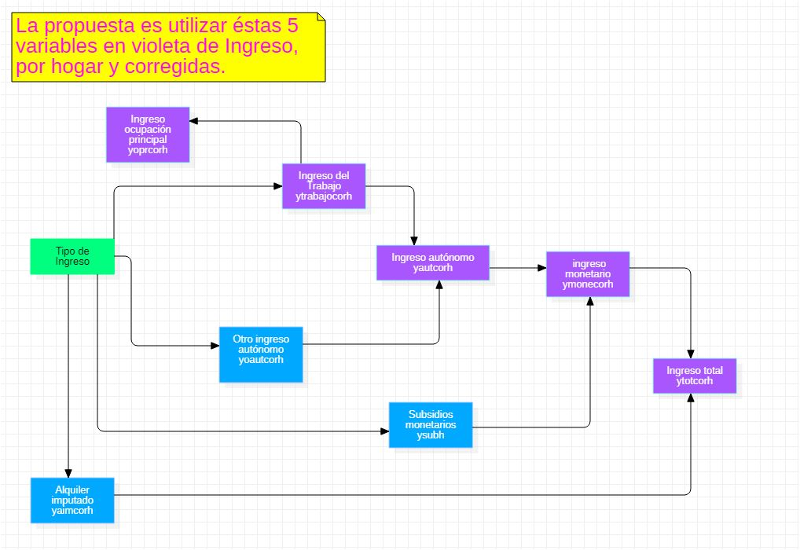

```{r setup, include=FALSE}
knitr::opts_chunk$set(echo = TRUE)

suppressWarnings(library(RODBC))

library(ggplot2)
library(ggpubr)
library(markdown)
library(shiny)
library(shinythemes)
library(tidyverse)
library(magrittr)
library(lubridate)
library(plotly)
library(xts)
library(dygraphs)
library(kableExtra)
library(knitr)
library("readxl")
library(rsconnect)
library(dplyr)
library(summarytools)
library(epiDisplay)
#library(leaflet)
library(haven)
library(epiDisplay)
library("readxl")
library(expss)
library(hrbrthemes)
library(viridis)
library(viridisLite)
library(DescTools)
library(roperators)
library(shinycssloaders)
library(writexl)
library(labelled)
library(tidyverse)
library(haven)
library(readr)
library(sjmisc)
library(WriteXLS)

library(ineq)
library(readstata13)
library(reldist)
# no queremos notacion científica:
options(scipen=999)
```

<br>

##################
<hr style="height:1px;border-width:1;color:LightGray;background-color:LightGray">
##################


## Índice

### 1 [Introducción](#test1)

### 2 [La relación entre los ingresos totales del hogar y el de las personas (yototcor-yototcorh)](#test2)

### 3 [La relación entre los ingresos de la ocupación principal versus los ingresos del trabajo (yoprcorh e ytrabajocorh)](#test3)

### 4 [El ingreso autónomo](#test4)

### 5 [El ingreso monetario](#test5)

### 6 [El alquiler imputado](#test6)

### 7 [Conclusiones](#test7)


<br>

##################
<hr style="height:1px;border-width:1;color:LightGray;background-color:LightGray">
##################


## 1 Introducción {#test1}

Con [un cálculo básico](https://rpubs.com/dataintelligence/la_construccion_del_ingreso) propusimos las variables de Ingreso en la Casen que deberíamos considerar y demostramos su descomposición como sumas simples. Pero lo hicimos a nivel de hogares. Debemos hacerlo a nivel de las personas para construir tablas de contigencia con sentido.

Ya tenemos una propuesta:


| año |          |   |   |   |
|-----|----------|---|---|---|
| 2017 | ytotcor | yautcor | ytrabajocor  | yoprcor  |
| 2015 | ytotcor | yautcor | ytrabajocor  | yoprcor  | 
| 2013 |ytotcor  |yautcor  |ytrabajocor   |yoprcor   |   
| 2011 |ytotaj   |yautaj   |ytrabaj       |yopraj    |  
| 2009 |ytotaj   |yautaj   |ytrabaj       |yopraj    |  
| 2006 |ytotaj   |yautaj   |ytrabaj       |yopraj    |  


Si el cálculo de la descomposición en forma de sumas simples es correcta para el año 2017, si estamos hablando de las mismas variables, es correcto para todos los años. Tenemos un trabajo que lo asegura.

Por lo mismo, el análisis que hacemos en éste documento es extensible al rango 2006-2017.


Iremos comparando las variables **ytotcor**, **yautcor**, **ytrabajocor** e **yoprcor** entre el nivel de personas y hogares e iremos verificando ciertos supuestos básicos que deben subyacer a las construcción de los ingresos.

Originalmente propusimos:



Consideraciones:

i. Tomamos siempre los ingresos corregidos (cor).

ii. Haremos el análisis sobre los ingresos del hogar, luego sobre el de las personas y compararemos.

<br>
<br>

##################
<hr style="height:1px;border-width:1;color:LightGray;background-color:LightGray">
##################


## 2 La relación entre los ingresos totales del hogar y el de las personas (ytotcorh-ytotcor){#test2}

### 1.1 La pregunta

####  La variable de ingresos que agrupa a todas las demás es **ytotcor**, que suma el ingreso monetario más el alquiler imputado. Ésta variable existe tanto para hogares como para personas. <span style="color:red"> Queremos saber si este valor es para los hogares el promedio del de las personas del hogar.
</span>

```{r}
# Leemos la base de datos
dataset_2017 <- readRDS(file = "casen_2017_c.rds")
```

Compararemos ambos resultados en la Casen del 2017.

### 1.1 ytotcorh: Los ingresos totales de las personas en los hogares:

```{r}
head(dataset_2017$ytotcorh,50)
```

### 1.2 ytotcor:  Ingresos totales de las personas:

```{r}
head(dataset_2017$ytotcor,50)
```

####  ¿Es el ingreso total de los hogares el promedio del de los integrantes? 

Si fuera así, el ingreso total del hogar siempre seria menor o igual al ingreso total personal: $$ ytotcor >= ytotcorh $$ 

pues en el hogar pueden existir miembros que no trabajen.

o bien en el caso de un hogar de dos personas que ganen aproximadamente los mismo: $$ ytotcor \approx  ytotcorh $$

#### <span style="color:red"> Observamos que el ingreso total de los hogares es mucho mayor al de las personas.
</span>


Si no son el promedio sospechamos que es la suma total, con lo que se cumpliria que:$$ ytotcor <<= ytotcorh $$ 


Para verificar lo anterior calculemos los promedios:

```{r}
c <- as.data.frame(dataset_2017$ytotcor)
mean(c, na.rm=TRUE)

d <- as.data.frame(dataset_2017$ytotcorh)
mean(d, na.rm=TRUE)
```


Verifiquémoslo de otra forma y veamos cuántos son los registros en los que ytotcor difiere de ytotcorh:

```{r}
a <- dataset_2017$ytotcorh[!(dataset_2017$ytotcorh %in% dataset_2017$ytotcor)]
length(a)
```
difieren 132617 registros.

#### <span style="color:red">  Concluímos que los ingresos totales son la suma de todos los ingresos de los integrantes del hogar, pues $$ ytotcor <<= ytotcorh $$ </span>

<br>
<br>

##################
<hr style="height:1px;border-width:1;color:LightGray;background-color:LightGray">
##################


## 3 La relación entre los ingresos de la ocupación principal versus los ingresos del trabajo (yoprcorh e ytrabajocorh){#test3}

### 3.1 Las preguntas

1. Queremos saber si el ingreso de la ocupación principal de los hogares es menor al ingreso del trabajo de los hogares:

Si es cierto, siempre deberia cumplirse que: $$ yoprcorh < ytrabajocorh $$


2. Queremos saber si ingreso del trabajo de la ocupación principal personal es diferente al ingreso de la ocupación principal del hogar.

3. También queremos saber si son menores los ingresos del trabajo de personas que el de los hogares. Especulamos que el ingreso del trabajo del hogar debiese ser mayor y la suma del personal. </span> 

Si lo anterior es cierto, siempre debería cumplirse que: $$ ytrabajocor <= ytrabajocorh $$

### 3.2 Ingresos de la ocupación principal en los hogares e ingresos del trabajo en los hogares

Los ingresos de la ocupación principal de los hogares:

```{r}
head(dataset_2017$yoprcorh,50)
```
Los ingresos del trabajo de los hogares:

```{r}
head(dataset_2017$ytrabajocorh,50)
```
Efectivamente, yoprcorh es una parte del ingreso del trabajo del hogar: ytrabajocorh, pero no tiene sentido que el trabajo de la ocupación principal personal sea diferente al ingreso de la ocupación principal del hogar, porque <span style="color:red">  generalmente es una persona la que trabaja en un núcleo, y si fueran dos, de todas formas sería una la que tendría una ocupación principal en el hogar que también sería su ingreso personal principal.  </span>  Corroboremos esto en la Casen:

### 3.3 Ingresos de la ocupación principal personal y de los hogares

Especulamos que los valores de éstos campos, debiesen ser los mismos.

```{r}
head(dataset_2017$yoprcor,50)
```
```{r}
head(dataset_2017$yoprcorh,50)
```
Al parecer ambos campos poseen la misma información.

```{r}
a <- dataset_2017$yoprcor[!(dataset_2017$yoprcor %in% dataset_2017$yoprcorh)]
a
```
En esta columna, la Casen posee información redundante.


### 3.4 Ingresos del trabajo: personas y hogares

¿Son menores los ingresos del trabajo de personas que el de sus hogares?  

Si lo anterior es cierto, siempre deberia cumplirse que: $$ ytrabajocor <= ytrabajocorh $$


```{r}
a <- dataset_2017$ytrabajocorh[!(dataset_2017$ytrabajocorh %in% dataset_2017$ytrabajocor)]
head(a,10)
```
Si. Los tres primeros registros y el decimo son diferentes.

Ingresos del trabajo de los hogares

```{r}
head(dataset_2017$ytrabajocorh,50)
```

Ingresos del trabajo de las personas

```{r}
head(dataset_2017$ytrabajocor,50)
```

y como es de esperar: 

$$ ytrabajocor <<= ytrabajocorh $$

Concluímos que el ingreso del trabajo de las personas en el hogar también (como ocurre en el caso de los ingresos totales) es la suma del ingreso del trabajo de las personas del hogar (y no como se podría pensar, el promedio).

<br>
<br>

##################
<hr style="height:1px;border-width:1;color:LightGray;background-color:LightGray">
##################


## 4 El ingreso autónomo <span style="color:red"> yautcorh (sin ayuda estatal) </span>{#test4}

Son los ingresos que generan las personas por su cuenta, excluyendo todo tipo de ayuda estatal.

Consiste en la suma del Ingreso del trabajo y otros Ingresos autónomos


Tiene sentido que el ingreso autónomo corregido de los hogares sea mayor al personal.

```{r}
head(dataset_2017$yautcorh,50)
```

```{r}
head(dataset_2017$yautcor,50)
```

#### <span style="color:red"> así es.  </span>

<br>
<br>

##################
<hr style="height:1px;border-width:1;color:LightGray;background-color:LightGray">
##################


## 5 El ingreso monetario <span style="color:red"> ymonecor  (con ayuda estatal)  </span> {#test5}

Los ingresos monetarios son coloquialmente toda la plata que en definitiva llega al bolsillo de las personas o de los hogares.

Los ingresos monetarios son la suma de:

1. los subsidios monetarios.
2. los ingresos autónomos (los ingresos del trabajo más otros ingresos autónomos).

### 5.1 Un campo mal calculado

####  Acá <span style="color:red"> nos encontramos con una columna  mal calculada en la base de datos de la encuesta Casen 2017 </span> . Los ingresos monetarios del hogar no pueden ser iguales a los personales, pues como vimos en el punto 2 "La relación entre los ingreso totales del hogar y de las personas", el ingreso total del hogar es mucho mayor al ingreso total personal.

#### Si el "Alquiler imputado" tiene el mismo valor para personas y hogares (como lo veremos en el punto 6), y el "Ingreso total" de los hogares es mayor que el de las personas, el "Ingreso monetario de los hogares" debe ser necesariamente superior al de las personas.

Ingreso monetario del hogar:

```{r}
head(dataset_2017$ymonecorh,50)
```

Ingreso monetario personal:

```{r}
head(dataset_2017$ymonecor,50)
```

Son iguales:

```{r}
a <- dataset_2017$ymonecorh[!(dataset_2017$ymonecorh %in% dataset_2017$ymonecor)]
head(a,50)
```

no existe ninguna diferencia en los primeros 50 registros.

### 5.2 Corrección al cálculo de los ingresos monetarios de las personas

Recordemos:

Los ingresos monetarios son la suma de:

1. los subsidios monetarios.
2. los ingresos autónomos.


#### 5.1.1 Subsidios.

La columna de los subsidios tanto del hogar como de las personas es correcta:

Subsidios personales:

```{r}
head(dataset_2017$ysub,50)
```
Subsidios del hogar:

```{r}
head(dataset_2017$ysubh,50)
```
#### 5.1.2 Ingresos autónomos.

La columna de los ingresos autónomos tanto del hogar como de las personas es correcta, como vimos en 4: "El ingreso autónomo":

Ingresos autónomos de las personas:

```{r}
head(dataset_2017$yautcor,50)
```
Ingresos autónomos de los hogares:

```{r}
head(dataset_2017$yautcorh,50)
```

#### 5.1.3 El error.

<span style="color:red"> El ingreso monetario de las personas, está mal calculado. </span>


Ingreso monetario de las personas:

```{r}
head(dataset_2017$ymonecor,50)
```

el tercer registro debiese ser: 786932, que es la suma: $$ ysub + yautcor  $$

```{r}
dataset_2017_ymonecor <- dataset_2017$ysub + dataset_2017$yautcor
dataset_2017_ymonecor[3]
```


Los valores del ingreso monetario para los hogares sin embargo, están bien, los cuales son la suma:

$$ ysubh + yautcorh  $$
Verifiquemoslo para el tercer registro:


```{r}
dataset_2017_ymonecorh <- dataset_2017$ysubh + dataset_2017$yautcorh
dataset_2017_ymonecorh[3]
```
Ingresos monetarios de los hogares:

```{r}
head(dataset_2017$ymonecorh,50)
```

Y vemos que el tercer registro coincide.

#### 5.1.4 La solución del error.

<span style="color:red"> El valor correcto para el ingreso monetario individual, se presenta en la variable ytotcor, por lo que deducimos que en el cálculo del ingreso total de las personas no está considerado el alquiler imputado. </span>


Ingreso total de las personas:

```{r}
head(dataset_2017$ytotcor,50)
```

Ingreso total de los hogares:

Acá se suma al valor del ingreso monetario, el monto del alquiler imputado, lo que no deja de tener sentido:

```{r}
head(dataset_2017$ytotcorh,50)
```

Verifiquémoslo para el tercer registro:

```{r}
dataset_2017_ytotcorh <- dataset_2017$ymonecorh + dataset_2017$yaimcorh
dataset_2017_ymonecorh[3]
```

<br>
<br>

##################
<hr style="height:1px;border-width:1;color:LightGray;background-color:LightGray">
##################

## 6 El alquiler imputado <span style="color:red"> yaimcor  </span> {#test6}

El alquiler imputado siempre es el mismo para las personas que para los hogares.


Alquiler imputado del hogar:

```{r}
head(dataset_2017$yaimcorh,50)
```

Alquiler imputado de las personas:

```{r}
head(dataset_2017$yaimcor,50)
```

<br>
<br>

##################
<hr style="height:1px;border-width:1;color:LightGray;background-color:LightGray">
##################

## 7 Conclusiones{#test7}

Se propone utilizar las siguientes variables en la construcción de tablas de contingencia:

1. yoprcor
2. ytrabajocor
3. yautcor
4. ytotcor

Con las variables que hemos elegido podemos deducir toda la estructura de ingresos de la encuesta Casen, tanto para personas como para hogares.
La Casen calcula los ingresos individuales sin alquiler imputado, lo que no deja de tener sentido y con lo que las críticas sobre la consecuente infraestimación de la pobreza se desvanece, por lo menos, en éste sentido.
Los ingresos del hogar representan su suma, no su promedio.
Queda la tarea pendiente de encontrar el nombre exacto de éstas 4 variables en las versiones previas de la Casen.


</br>
</br>
</br>


