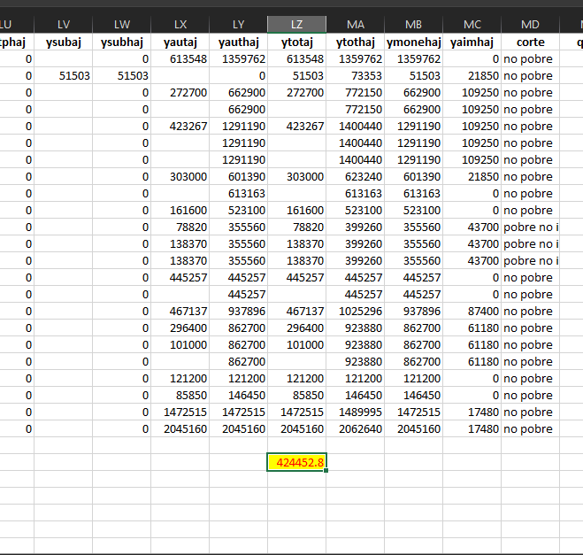

<style type="text/css">

.main-container {
  max-width: 1300px;
  margin-left: auto;
  margin-right: auto;
}

body, td {
    font-family: Helvetica;
    font-size: 22px;
}
code.r{
  font-size: 12px;
}
pre {
  font-size: 18px;
}
</style>
```{r , message=FALSE, warning=FALSE, include = FALSE, echo = FALSE}

suppressWarnings(library(RODBC))

library(ggplot2)
library(ggpubr)
library(markdown)
library(shiny)
library(shinythemes)
library(tidyverse)
library(magrittr)
library(lubridate)
library(plotly)
library(xts)
library(dygraphs)
library(kableExtra)
library(knitr)
library("readxl")
library(rsconnect)
library(dplyr)
library(summarytools)
library(epiDisplay)
#library(leaflet)
library(haven)
library(epiDisplay)
library("readxl")
library(expss)
library(hrbrthemes)
library(viridis)
library(viridisLite)
library(DescTools)
library(roperators)
library(shinycssloaders)
library(writexl)
library(labelled)
library(tidyverse)
library(haven)
library(readr)
library(sjmisc)
library(WriteXLS)


library(readstata13)
```

# Índice

[1. Algunos conceptos sobre el Ingreso. ](#test1)

[2. Las variables de ingreso](#test2)

[3. Promedios sobre un conjunto de categorías.](#test3)

[4. Regresión logística sobre la probabilidad de ser pobre según ingreso.](#test4)


<hr/>
<br>
<br>


## Algunos conceptos sobre el Ingreso.{#test1}

<font size="4">

La distribución del ingreso se analiza considerando dos tipos de ingresos: los
autónomos y los monetarios. 

Los ingresos autónomos corresponden a aquellos que
generan los hogares por sus propios medios (sin incorporar las transferencias del
Estado) e incluyen por lo tanto los ingresos del trabajo, los ingresos asociados a la
posesión de bienes de capital (arriendos, intereses, rentas), aquellos provenientes
de jubilaciones y pensiones contributivas, y otros ingresos de origen privado
(transferencias de otros miembros de la familia, donaciones). El ingreso autónomo o ingreso primario, se define como todos los pagos que recibe el hogar como resultado de la posesión de factores productivos. Incluye sueldos y salarios, ganancias del trabajo independiente, la autoprovisión de bienes producidos por el hogar, rentas, intereses, pensiones y jubilaciones.

Los ingresos
monetarios suman a los ingresos autónomos los subsidios de carácter monetario
que distribuye el Estado a través de sus programas sociales.
El ingreso monetario corresponde a la suma de los ingresos autónomos que
generan los hogares más el conjunto de subsidios monetarios que el Estado
transfiere directamente. Respecto de los subsidios monetarios, la Encuesta CASEN
recoge información sobre subsidios focalizados y no focalizados. En los subsidios
focalizados se incluyen: Pensiones Asistenciales (PASIS), Subsidio Familiar (SUF),
Subsidio de Agua Potable (SAP) y los Bonos Chile Solidario. Por otra parte, dentro
de los subsidios no focalizados la encuesta recoge información acerca del Subsidio
de Cesantía y la Asignación Familiar. En definitiva, el ingreso monetario se define como la suma del ingreso autónomo del hogar y las transferencias monetarias que recibe el hogar desde el Estado.

**Ajuste de ingresos**

El ajuste de ingresos es realizado por la División de Estadísticas de CEPAL con el
objetivo de evaluar la omisión y la subdeclaración de los ingresos reportados por
los encuestados. Para esto, CEPAL utiliza la información de Cuentas Nacionales
proporcionada por el Banco Central de Chile. La metodología utilizada es la misma
que en las versiones anteriores de la Encuesta, lo que asegura la comparabilidad
de las estimaciones.
</font>

## Las variables que trae la Casen 2006 sobre ingreso. Son todos valores en $. {#test2}


### Módulo de ingresos

**Ingresos del trabajo**: Corresponden a los ingresos que obtienen las personas en su ocupación por concepto de sueldos y salarios, monetarios y en especies, ganancias provenientes del trabajo independiente y la auto-provisión de bienes producidos por el hogar.

**Y0101AJ** Asalariados principal - Sueldos y salarios monetarios (ajustados) (pesos por mes)

**Y0101HAJ** Asalariados principal - Sueldos y salarios monetarios en el hogar (ajustado) (pesos por
mes)

#### **Previsión**: 15 años y más.

**YFAMAJ** Ingreso por Asignación familiar en las personas (pesos por mes)

**YFAMHAJ** Ingreso por Asignación familiar en el hogar (pesos por mes)

**YJUBAJ** Ingreso por pensión de vejez o jubilación (pesos por mes)

**YJUBHAJ** Ingreso por pensión de vejez o jubilación, en el hogar (pesos por mes)

**YVITAJ** Ingreso por renta vitalicia (pesos por mes)

**YVITHAJ** Ingreso por renta vitalicia, en el hogar (pesos por mes)


**YINVAJ** Ingreso por pensión de invalidez (pesos por mes)

**YINVHAJ** Ingreso por pensión de invalidez, en el hogar (pesos por mes)


**YMONAJ** Ingreso por montepío o pensión de viudez (pesos por mes)

**YMONHAJ** Ingreso por montepío o pensión de viudez, en el hogar (pesos por mes)

**YORFAJ** Ingreso por pensión de orfandad (pesos por mes)

**YORFHAJ** Ingreso por pensión de orfandad, en hogar (pesos por mes)

### Variables creadas a partir de la encuesta. 

### Ingresos del trabajo

**YOPRAJ** Ingreso Ocupación Principal (ajustado) (pesos por mes)  Ingreso que obtienen los ocupados en su ocupación principal, ya sea por concepto de trabajo dependiente en el caso de los asalariados, o por concepto de trabajo independiente en el caso de los patrones o empleadores y trabajadores por cuenta propia.

**YOPRHAJ** Ingreso Ocupación Principal en el hogar (ajustado) (pesos por mes)

**YTRABAJ** Ingreso del Trabajo (ajustado) (pesos por mes)

**YTRABHAJ** Ingreso del Trabajo en el hogar (ajustado) (pesos por mes)

### Subsidios monetarios

**YPASAJ** PASIS, Pensión Asistencial (pesos por mes)

**YPASHAJ** PASIS, Pensión Asistencial en el hogar (pesos por mes)

**YBSPSAJ** Bonos del Sistema de Protección Social

**YBSPSHAJ** Bonos del Sistema de Protección Social en el hogar

**YSUFAJ** SUF, Subsidio Único Familiar

**YSUFHAJ** SUF, Subsidio Único Familiar en el hogar (pesos por mes)

**YCESAJ** Subsidio de Cesantía (pesos por mes)

**YCESHAJ** Subsidio de Cesantía en el hogar (pesos por mes)

**Y1814HAJ** Subsidio Agua Potable (pesos por mes)

**YOTPAJ** Otro Subsidio del Estado (pesos por mes)

**YOTPHAJ** Otro Subsidio del Estado en el hogar (pesos por mes)

**YSUBAJ** Subsidios monetarios (pesos por mes)

**YSUBHAJ** Subsidios monetarios en el hogar (pesos por mes)

### Otros ingresos

**YAUTAJ** Ingreso Autónomo (ajustado) (pesos por mes)

**YAUTHAJ** Ingreso Autónomo del hogar (ajustado) (pesos por mes) Para cada hogar, es la suma de los ingresos autónomos de todos los miembros del hogar, excluido el servicio doméstico puertas adentro.

**YTOTAJ** Ingreso total (ajustado) (pesos por mes)

**YTOTHAJ** Ingreso total en el hogar (ajustado) (pesos por mes)

**YMONEHAJ** Ingreso Monetario del hogar (ajustado) (pesos por mes)

**YAIMHAJ** Alquiler imputado (ajustado) (pesos por mes)


**Fuentes:**

1 Casen 2006 Encuesta de Caracterizacion Socioeconomica Nacional. Manual de usuario. Base de datos.

2 SERIE ANÁLISIS DE RESULTADOS DE LA
ENCUESTA DE CARACTERIZACIÓN SOCIOECONÓMICA NACIONAL
(CASEN 2006)
Nº 2 Distribución del Ingreso e Impacto Distributivo del Gasto Social 2006

[http://observatorio.ministeriodesarrollosocial.gob.cl/casen/casen-documentos.php?c=107&m=2&a=2006](http://observatorio.ministeriodesarrollosocial.gob.cl/casen/casen-documentos.php?c=107&m=2&a=2006)

3 [http://observatorio.ministeriodesarrollosocial.gob.cl/glosario.php](http://observatorio.ministeriodesarrollosocial.gob.cl/glosario.php)


***

## Promedios sobre un conjunto de categorías.{#test3}

<font size="4">

Hemos obtenido las frecuencias con las que aparece cierta combinación de categorías en la población, como por ejemplo, etnia, alfabetismo y sexo por comuna. Por nuestro trabajo, ya sabemos que en la comuna de Aisén, los hombres que vivían en zonas rurales y que tenían 89 años el año 2006 eran 8.

Ahora, en vez de frecuencias necesitamos obtener promedios.

Cobra relevancia conocer el promedio de los Ingresos totales ajustados en pesos por mes **YTOTAJ** que obtienen ciertas categorías de nuestras búsquedas.
Y así deseamos saber el promedio de Ingresos totales ajustados que posee cada una de las categorías definidas por sexo, etnia y alfabetismo en las comunas de Chile para el 2006.

Se deberían generar éstas tablas para todas las definiciones de ingreso.

</font>


#######################

1 Leemos la data.

```{r}
dataset2006  <- readRDS("dataset2009.rds")

```
2 Filtramos según nuestros requerimientos y obtenemos 33 registros.

```{r}
iquique_2006 <- dataset2006[dataset2006$comuna == "iquique ",]
iquique_2006 <- iquique_2006[iquique_2006$sexo == "hombre",]
iquique_2006 <- iquique_2006[iquique_2006$t5 == "aymara",]
iquique_2006 <- iquique_2006[iquique_2006$e1 == "sí",]
iquique_2006
nrow(iquique_2006)
```

3 Existen unos NA que debemos eliminar y grabemos el resultado, que será con el que vamos a probar nuestro código al final.

```{r}
data6 <- filter(iquique_2006, rowSums(is.na(iquique_2006)) != ncol(iquique_2006))  
nrow(data6)
write_xlsx(data6,'data6.xlsx')
```


```{r}
colnames(iquique_2006)
```


4 Por fin obtengamos nuestra media.

```{r}
mean(iquique_2006$ytotaj, na.rm=TRUE)
```

5 Verificamos el número 23 de observaciones de nuestro data6 lanzando una tabla de contingencia con nuestras categorías. Despleguemos sólo las primeras 10 filas.

```{r}
dataset2006  <- readRDS("dataset2009.rds")
m <- table(dataset2006$comuna, dataset2006$e1, dataset2006$sexo,dataset2006$t4)
tabla <- as.data.frame(m)
head(tabla,10)
```
6 Generalizamos. Desplegamos las 10 primeras filas.

```{r}
dataset2006  <- readRDS("dataset2017.rds")
promedios_grupales <-aggregate(dataset2006$ymonecorh, by=list(dataset2006$comuna,dataset2006$e1,dataset2006$r3,dataset2006$sexo), FUN = mean , na.rm = TRUE)
head(promedios_grupales,10)
```
7 Verifiquemos con el excel que guardamos.

[Volver]() 

## Regresión logística sobre la probabilidad de ser pobre según ingreso. {#test4}


https://uc-r.github.io/logistic_regression]


<!-- ```{r} -->
<!-- dataset2006  <- readRDS("dataset2006.rds") -->
<!-- ``` -->

<!-- ```{r} -->
<!-- model1 <- glm(dataset2006$corte ~dataset2006$ytotaj, family = "binomial", data = dataset2006) -->
<!-- summary(model1) -->
<!-- ``` -->


Las estimaciones de los coeficientes de la regresión logística caracterizan la relación entre el predictor y la variable de respuesta en una escala log-odds. Entonces, vemos que β1 = -0.00002666, esto indica que una disminución de 1 peso en ytotaj está asociado con un aumento en la probabilidad de ser pobre. Se asocia con un aumento en las probabilidades de ser pobre logarítmico de 0.00002666 unidades.

Podemos interpretar el coeficiente de ytotaj como: por cada aumento de un peso en ytotaj, las probabilidades de no ser pobre aumentan en un factor de 1,00002666.

Podemos medir los intervalos de confianza y la precisión de las estimaciones de los coeficientes calculando sus errores estándar.

β1 tiene un valor p <2e-16, lo que sugiere una relación estadísticamente significativa entre ytotaj y la probabilidad de ser pobre. 

# ```{r}
# dataset2006 %>%
#   mutate(prob = ifelse(dataset2006$corte == "no pobre", 1, 0)) %>%
#   ggplot(aes(dataset2006$yauthaj, prob)) +
#   geom_point(alpha = .15) +
#   geom_smooth(method = "glm", method.args = list(family = "binomial")) +
#   ggtitle("Ajuste del modelo de regresión logístico.") +
#   xlab("ytotaj") +
#   ylab("Probability of ser pobre")
# ```


