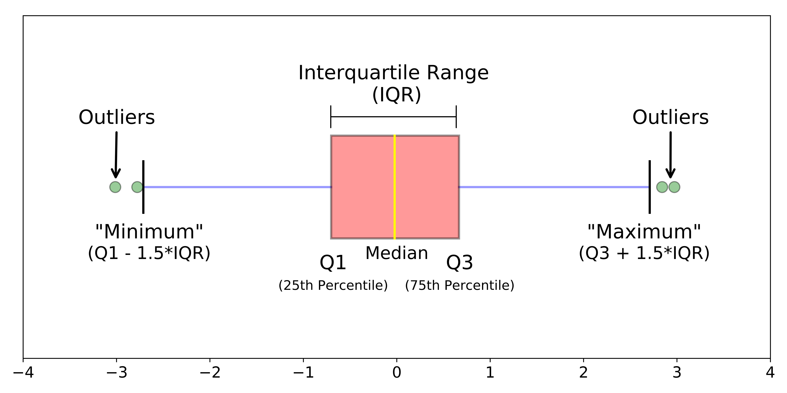

```{r, include=FALSE,  message=FALSE, warning=FALSE, echo = FALSE}

knitr::opts_chunk$set(echo = TRUE)

suppressWarnings(library(RODBC))

library(ggplot2)
library(ggpubr)
library(markdown)
library(shiny)
library(shinythemes)
library(tidyverse)
library(magrittr)
library(lubridate)
library(plotly)
library(xts)
library(dygraphs)
library(kableExtra)
library(knitr)
library("readxl")
library(rsconnect)
library(dplyr)
library(summarytools)
library(epiDisplay)
#library(leaflet)
library(haven)
library(epiDisplay)
library(expss)
library(hrbrthemes)
library(viridis)
library(viridisLite)
library(DescTools)
library(roperators)
library(shinycssloaders)
library(writexl)
library(labelled)
library(tidyverse)
library(haven)
library(readr)
library(sjmisc)
library(WriteXLS)
library(readstata13)
library(plotly)
library(readxl)

# https://www.r-bloggers.com/2020/01/how-to-remove-outliers-in-r/
      
      
```


<!-- ```{r, include=FALSE,  message=FALSE, warning=FALSE, echo = FALSE} -->

<!-- casen_2006 <- readRDS(file = "casen_2006_c.rds") -->

<!-- ab <- casen_2006 -->

<!-- a <- ab$YAUTHAJ -->
<!-- b <- ab$COMUNA -->
<!-- c<- ab$codigo -->
<!-- d<- ab$E1 -->
<!-- e <- ab$T4 -->
<!-- f <- ab$SEXO -->

<!-- promedios_grupales <-aggregate(a, by=list(b, c, d, e, f), FUN = mean , na.rm = TRUE) -->

<!-- promedios_grupales_sd <-aggregate(a, by=list(b, c, d, e, f), FUN = sd , na.rm = TRUE) -->


<!-- promedios_grupales$anio <- "2006" -->

<!-- names(promedios_grupales)[1] <- "Comuna"      -->
<!-- names(promedios_grupales)[2] <- "Código" -->
<!-- names(promedios_grupales)[3] <- "Sabe leer?" -->
<!-- names(promedios_grupales)[4] <- "Etnia" -->
<!-- names(promedios_grupales)[5] <- "Sexo" -->
<!-- names(promedios_grupales)[6] <- "Promedio del Ingreso autónomo del hogar" -->
<!-- names(promedios_grupales)[7] <- "Año"   -->

<!-- head(promedios_grupales,5) -->
<!-- head(promedios_grupales_sd,5) -->
<!-- #write_xlsx(promedios_grupales, "Promedio_ingresos_autonomoshogar_sexo_etnia_alfa_2006.xlsx") -->
<!-- ``` -->


<!-- ```{r, include=FALSE,  message=FALSE, warning=FALSE, echo = FALSE} -->
<!-- library(dplyr) -->
<!-- dataset2015 <- readRDS(file = "casen_2015_c.rds") -->
<!-- ab <- dataset2015 -->

<!-- ``` -->

## Teoría

Los valores notablemente diferentes de la mayoría en un conjunto de datos se conocen como atípicos u outliers. Son anomalías que ocurren debido a errores de medición, no  siempre siendo el resultado de observaciones mal registradas, sino que también producto de fluctuaciones naturales. Pueden también ser sólo simplemente hallazgos importantes.

Los valores atípicos pueden ser peligrosos porque la mayoría de los estadísticos, como la media, la desviación estándar y la correlación, son muy sensibles a ellos.

Si es bueno o no eliminarlos de un conjunto de datos, depende de si afectan al modelo de manera positiva o negativa, requiriéndose para ello de cierta investigación. Sin embargo, no se recomienda descartar una observación simplemente porque parezca ser un valor atípico.

En el estudio de la distribución de los ingresos de la Casen nos encontramos con múltiples outliers que distorsionan su comprensión. Deberemos eliminarlos.


Para lo anterior nos serviremos del diagrama de caja y bigotes. El diagrama de caja y bigotes suele ser considerado muy básico, sin embargo entrega información notable. Tanto, que debemos repasar algunos estadísticos básicos.

### 1.1 Los outliers en los diagramas de caja y bigotes y el rango intercuartílico.

#### 1.1.1 Media, mediana y moda. 

La media: es simplemente el promedio de un conjunto de datos. 

La mediana: es el número que deja por debajo de sí a la mitad de los datos, una vez que éstos están ordenados de menor a mayor. 

Por ejemplo, la mediana del número de hijos de un conjunto de trece familias, cuyos respectivos hijos son: 

3, 4, 2, 3, 2, 1, 1, 2, 1, 1, 2, 1 y 1, es 2, puesto que, una vez ordenados los datos: 

1, 1, 1, 1, 1, 1, 2, 2, 2, 2, 3, 3, 4, el que ocupa la posición central es 2:


${\displaystyle {\rm {\underbrace {1,\ 1,\ 1,\ 1,\ 1,\ 1,} _{Mitad\;inferior}\;\underbrace {\color {Red}2,} _{Mediana\;}\;\underbrace {2,\ 2,\ 2,\ 3,\ 3,\ 4} _{Mitad\;superior}}}}$


En caso de un número par de datos, la mediana no correspondería a ningún valor de la variable, por lo que se conviene en tomar como mediana el valor intermedio entre los dos valores centrales. Por ejemplo, en el caso de doce datos como los siguientes:

${\displaystyle {\rm {\underbrace {1,\ 1,\ 1,\ 1,\ 1,} _{Valores\;inferiores}\;\underbrace {\color {Red}1,\ 2,} _{Valores\;intermedios}\;\underbrace {2,\ 2,\ 3,\ 3,\ 4} _{Valores\;superiores}}}}$

Se toma como mediana:
$1,5 = \frac{{\color{Red}1}+{\color{Red}2}}{2}$

La moda es el valor de una distribución de números que más se repite.

#### 1.1.2 Los percentiles y el rango intercuartílico. 

Rango intercuartilico.

El rango intercuartilico es la diferencia entre el tercer y el primer cuartil (Q3 - Q1), en el que se distribuyen aproximadamente el 50% de las observaciones centrales de la variable, o dicho de otra forma, el rango intercuartílico es el 50% central o el área entre el percentil 75 y el 25 de una distribución. El rango intercuartílico es una medida de la dispersión de éste colectivo. Así pues, un rango pequeño significa que los datos centrales están muy juntos, mientras que un rango grande indica una fuerte dispersión.


#### 1.1.3 El diagrama de caja y bigotes (box-plot).

Un box-plot es una forma de ver la información de un histograma concentrada en una dimensión.


El diagrama de caja y bigotes muestra cinco piezas de información clave:

1. El mínimo (el número más pequeño del conjunto de datos). El mínimo se muestra en el extremo inferior del gráfico.

2. El primer cuartil, Q1, es el extremo inferior de la caja.

3. La mediana se muestra como una línea en el centro de la caja.

4. Tercer cuartil, Q3, que se muestra en el extremo superior de la caja (en el extremo inferior del bigote superior).

5. El máximo (el número más grande en el conjunto de datos), que se muestra en el extremo superior del bigote superior.


#### 1.1.4 Cómo leer un diagrama de caja y bigotes: 

1. Encuentra el mínimo.
El mínimo es el extremo izquierdo del gráfico, en la punta del bigote izquierdo. 

2. Encuentre Q1, el primer cuartil.
Q1 está representado por el lado izquierdo del recuadro.

3. Encuentra la mediana.
La mediana está representada por la barra vertical amarilla. 

4. Encuentra Q3, el tercer cuartil.

5. Encuentra el máximo.




### 1.2. Determinación de los outliers.

Vimos que el rango intercuartílico (IQR) es el 50% central o el área entre el percentil 75 y el 25 de una distribución. *Se define un punto como atípíco si está por encima del percentil 75 o por debajo del percentil 25 en un factor de 1,5 veces el IQR*.

Por ejemplo, si:

Q1 = percentil 25

Q3 = percentil 75

Entonces, IQR = Q3 - Q1

Y un valor atípico sería un punto por debajo de [Q1- (1.5) IQR] o por encima de [Q3 + (1.5) IQR].


### 1.3. Métodos estadísticos para encontrar valores atípicos en un conjunto de datos.


La visualización no siempre es la forma más eficaz de analizar valores atípicos. El conjunto de datos puede tener cientos de miles de observaciones. Es importante tener un límite numérico que diferencie un valor atípico de uno no atípico, lo que permite trabajar con cualquier conjunto de datos, independientemente de su tamaño.

Utilizaremos la función quantile() para encontrar los percentiles 25 y 75 del conjunto de datos y la función IQR() que da la diferencia de los percentiles 75 y 25.

    Q <- quantile(dataset$columna, probs = c (.25, .75), na.rm = FALSE)


La función IQR también requiere vectores numéricos y, por lo tanto, los argumentos se pasan de la misma manera.

    iqr <- IQR(dataset$columna)

Ahora que conoces el IQR y los cuantiles, puedes encontrar los rangos de corte más allá de los cuales todos los puntos de datos son valores atípicos.

    sobre <- Q[2] + 1.5 * iqr # Rango superior
    bajo <- Q[1] - 1.5 * iqr # Rango inferior

## Práctica

### 2.1. Estudio del promedio de ingresos según un conjunto de categorías en la Casen: yautcorh del 2015.

No podemos leer la estructura del diagrama de caja y bigotes por la masiva presencia de outliers.

Al graficar el ingreso autónomo familiar por etnia nos damos cuenta de valores outliers muy grandes en la categoría: "No pertenece a ningun pueblo indígena", pero en general en todas.

<br>

```{r, message=FALSE, warning=FALSE, echo = FALSE}

dataset2015 <- readRDS(file = "casen_2015_c.rds")
ab <- dataset2015


fig <- plot_ly(dataset2015 , y = ~yautcorh, color = ~r3, type = "box",
              boxmean = "sd",
            colors = "BrBG", boxpoints=F)%>% 
  layout(title = "Promedio del ingreso autónomo familiar por Etnia",
         xaxis = list(title = "Etnia"))
fig
```

Lo anterior es evidencia de que por la masiva presencia de outliers **no obtenemos una información real**.


Obtengamos un subset con la etnia "No pertenece a ningún pueblo indígena" y grafiquemos por sexo:

<br>

```{r, message=FALSE, warning=FALSE, echo = FALSE}
#head(dataset2015$yautcorh,5)

filter <- dataset2015 %>% group_by(yautcorh) %>% filter(r3 == "No pertenece a ningún pueblo indígena")
filter2 <- filter$yautcorh
```


```{r, message=FALSE, warning=FALSE, echo = FALSE}
library(plotly)
fig <- plot_ly(filter , y = ~yautcorh,  color = ~sexo,type = "box",
              boxmean = "sd",
            colors = "Dark2", boxpoints=F)%>% 
  layout(title = "Promedio del ingreso autónomo familiar por Etnia (yautcorh)",
         xaxis = list(title = "No pertenece a ningún pueblo indígena"))
fig
```


```{r, message=FALSE, warning=FALSE, echo = FALSE}
dataset2015 <- readRDS(file = "casen_2015_c.rds")

ab <-dataset2015 
      
a <- ab$yautcorh
b <- ab$comuna
d<- ab$e1
e <- ab$r3
f <- ab$sexo
```


```{r, message=FALSE, warning=FALSE, echo = FALSE, results='hide'}

promedios_grupales <-aggregate(a, by=list(b,  d, e, f), FUN = mean , na.rm = TRUE)


promedios_grupales$anio <- "2015"
      
names(promedios_grupales)[1] <- "Comuna"     
names(promedios_grupales)[2] <- "Sabe leer?"
names(promedios_grupales)[3] <- "Etnia"
names(promedios_grupales)[4] <- "Sexo"
names(promedios_grupales)[5] <- "yautcorh"

head(promedios_grupales,5)


```


```{r, message=FALSE, warning=FALSE, echo = FALSE, results='hide'}
promedios_grupales_sd <-aggregate(a, by=list(b,  d, e, f), FUN = sd , na.rm = TRUE)

head(promedios_grupales_sd,5)
```

No podemos leer el gráfico de caja y bigotes. Obtengamos la tabla con los valores de los promedios del ingreso autónomo corregido familiar.


```{r, message=FALSE, warning=FALSE, echo = FALSE}

promedios_grupales$desviacion = promedios_grupales_sd$sd.a
head(promedios_grupales,10)%>%
  kbl()%>%
  kable_classic(full_width = F, html_font = "Cambria")

# knitr::kable(promedios_grupales, align = "lccrr")
```
Observamos que los promedios de ingresos son exageradamente altos y que las desviaciones standard también lo son. Comunas como Mejillones tienen sd NA. Lo último ocurre cuando existe sólo una observación.


```{r, message=FALSE, warning=FALSE}
filter <- dataset2015 %>% group_by(yautcorh) %>% filter(comuna == "Mejillones") %>% filter(e1 == "Sí, lee y escribe") %>% filter(r3 == "Aimara") %>% filter(sexo == "Hombre")
filter$yautcorh
```


### 2.2.  El criterio estadístico

Eliminando valores atípicos:

Aplicaremos el criterio de exclusión si se supera 1.5 veces el IQR por arriba o por abajo y grafiquemos el ingreso autónomo familiar corregido a nivel nacional en la Casen del 2015.

```{r}
Q <- quantile(promedios_grupales$yautcorh, probs=c(.25, .75), na.rm = FALSE)
iqr <- IQR(promedios_grupales$yautcorh)
eliminated <- subset(promedios_grupales, promedios_grupales$yautcorh > (Q[1] - 1.5*iqr) & promedios_grupales$yautcorh < (Q[2]+1.5*iqr))
```

Ahora los rangos son mucho más comprensibles y cercanos a la realidad.


```{r, message=FALSE, warning=FALSE, echo = FALSE}
fig <- plot_ly(eliminated , y = ~yautcorh, type = "box",
              boxmean = "sd",
            colors = "BrBG", boxpoints=F)%>% 
  layout(title = "Promedio del ingreso autónomo familiar por Etnia",
         xaxis = list(title = "No pertenecen a ningun pueblo indigena"))
fig
```
y lo mismo ocurre si graficamos el yautcorh para quienes no pertenecen a ninguna etnia, por sexo:

```{r, message=FALSE, warning=FALSE, echo = FALSE}
dataset2015 <- readRDS(file = "casen_2015_c.rds")
ab <- dataset2015

Q <- quantile(ab$yautcorh, probs=c(.25, .75), na.rm = FALSE)

iqr <- IQR(ab$yautcorh)
up <-  Q[2]+1.5*iqr # Upper Range  
low <- Q[1]-1.5*iqr # Lower Range

eliminated <- subset(ab, ab$yautcorh > (Q[1] - 1.5*iqr) & ab$yautcorh < (Q[2]+1.5*iqr))

library(plotly)
fig <- plot_ly(eliminated , y = ~yautcorh,  color = ~sexo,type = "box",
              boxmean = "sd", boxpoints=F,
            colors = "Dark2", boxpoints=T)%>% 
  layout(title = "Promedio del ingreso autónomo familiar por Etnia (yautcorh)",
         xaxis = list(title = "No pertenece a ningún pueblo indígena"))
fig
```

### 2.3.  Cálculo de promedios y sd sin outliers:

```{r, message=FALSE, warning=FALSE, echo = FALSE}

a <- eliminated$yautcorh
b <- eliminated$comuna
d<- eliminated$e1
e <- eliminated$r3
f <- eliminated$sexo

promedios_grupales <-aggregate(a, by=list(b,  d, e, f), FUN = mean , na.rm = TRUE)

promedios_grupales_sd <-aggregate(a, by=list(b,  d, e, f), FUN = sd , na.rm = TRUE)

# head(promedios_grupales_sd,5)

promedios_grupales$sd = promedios_grupales_sd$sd.a

head(promedios_grupales,10)%>%
  kbl()%>%
  kable_classic(full_width = F, html_font = "Cambria")

```
Obtenemos finalmente el cálculo de los promedios corregidos con sus respectivas sd para cada categoría estudiada, los cuales se aproximan mucho más a los valores esperados y cuyas desviaciones standard son más bajas que cuando incluíamos a los outliers.

Finalmente tenemos el código con el que generamos tablas de promedios de ingresos (o deudas o ahorros) por categoría corregidos.

### 2.4.  El código reformado:


```{r, message=FALSE, warning=FALSE, results='hide'}
dataset2015 <- readRDS(file = "casen_2015_c.rds")
ab <- dataset2015

Q <- quantile(ab$yautcorh, probs=c(.25, .75), na.rm = FALSE)
iqr <- IQR(ab$yautcorh)

eliminated <- subset(ab, ab$yautcorh > (Q[1] - 1.5*iqr) & ab$yautcorh < (Q[2]+1.5*iqr))

a <- eliminated$yautcorh
b <- eliminated$comuna
d<- eliminated$e1
e <- eliminated$r3
f <- eliminated$sexo

promedios_grupales <-aggregate(a, by=list(b,  d, e, f), FUN = mean , na.rm = TRUE)
promedios_grupales_sd <-aggregate(a, by=list(b,  d, e, f), FUN = sd , na.rm = TRUE)
promedios_grupales$sd = promedios_grupales_sd$sd.a

```

### 2.5.  Conclusiones:

Ya tenemos un criterio estadístico para eliminar outliers y construir promedios de ingresos según categorías más realistas. Ahora, La desigualdad de los ingresos puede obedecer a la curva normal, esto es, una sociedad puede manifestar niveles de desigualdad homogéneamente distribuídos, pero en el caso que hemos estudiado, los ingresos son forzados a la baja. La mayoría de la población no posee ingresos medios, sino que bajos respecto al total.


