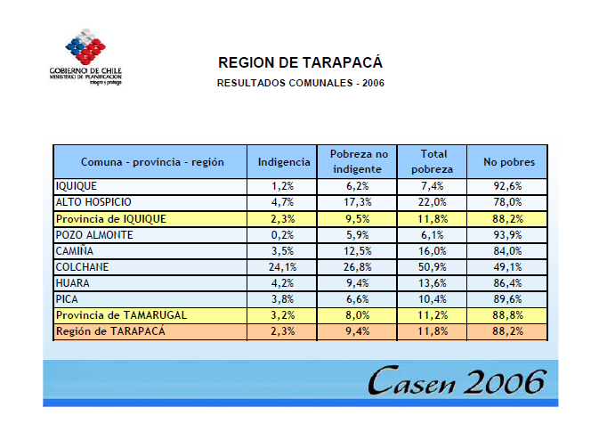
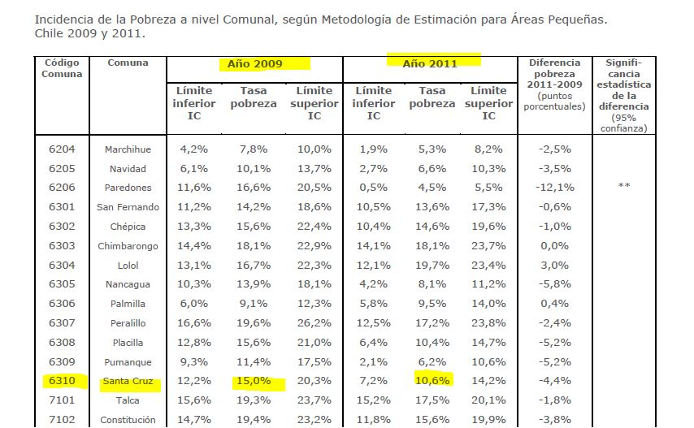
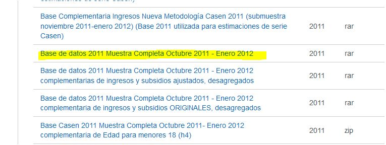
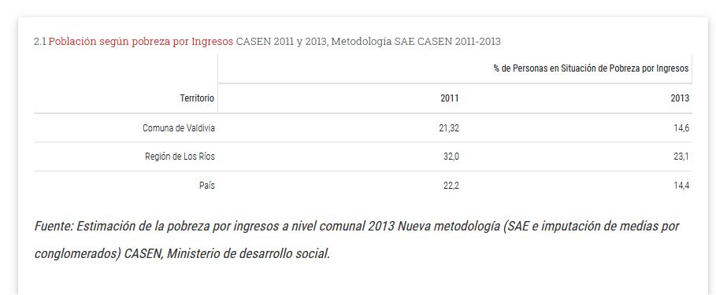
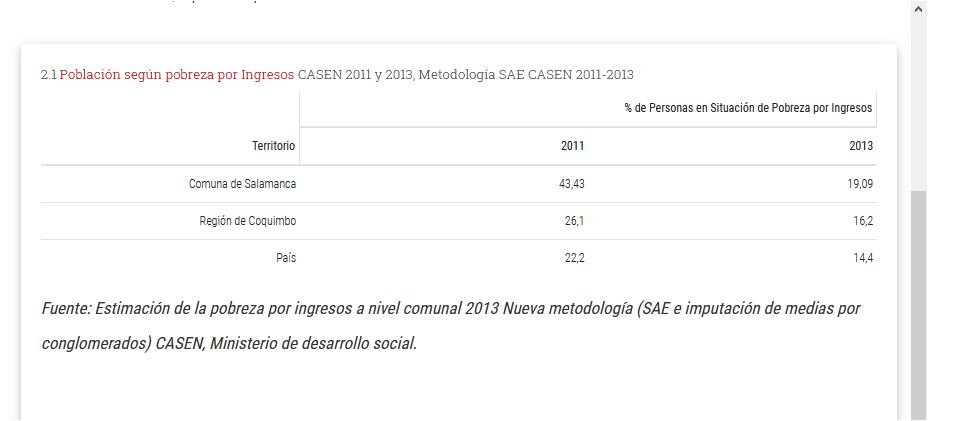
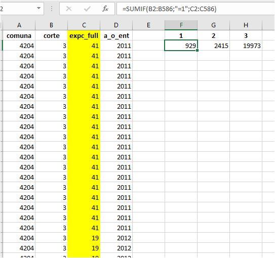

```{r , message=FALSE, warning=FALSE, include = FALSE, echo = FALSE}
knitr::opts_chunk$set(echo = TRUE)
library(ggplot2)
library(ggpubr)
library(markdown)
library(shiny)
library(shinythemes)
library(tidyverse)
library(magrittr)
library(lubridate)
library(plotly)
library(xts)
library(dygraphs)
library(kableExtra)
library(knitr)
library("readxl")
library(rsconnect)
library(dplyr)
library(summarytools)
library(epiDisplay)
#library(leaflet)
library(haven)
library(epiDisplay)
library("readxl")
library(hrbrthemes)
library(viridis)
library(viridisLite)
library(writexl)
library(plyr)
library(kableExtra)
library(knitr)
library(DescTools)

# https://www.datacamp.com/community/tutorials/contingency-tables-r


oldw <- getOption("warn")
options(warn = -1)
```

### Introducción

Necesitamos que nuestras estimaciones de pobreza obtenidas con cálculos propios desde la Casen coincidan con la información ya publicada.

Hicimos 6 contrastes, en algunos acertamos y en otros no. Para el primero, en el que consideramos la pobreza en Iquique para el 2006, nuestras estimaciones coinciden perfectamente. Éste resultado indica que nuestra metodología de cálculo es correcta, pero que sin embargo, pueden existir errores de nuestra parte (al no considerar correctamente las variables de la Casen referidas a la pobreza o tomando un factor de expansión errado)
como también, y eso lo veremos en el quinto y el sexto contraste, posibles errores de calculo de la fuente.

### Primer contraste: **Iquique 2006**

1 El siguiente link nos dirige a un documento oficial que entrega los porcentajes de pobreza comunal en la región de Tarapaca calculados a partir de la Casen del 2006.


[ir al documento](https://www.google.com/url?sa=t&rct=j&q=&esrc=s&source=web&cd=&ved=2ahUKEwjNqMv3s-TtAhV4HrkGHRjdBs8QFjADegQIBBAC&url=http%3A%2F%2Fwww.ministeriodesarrollosocial.gob.cl%2Fbtca%2Ftxtcompleto%2Fmideplan%2Fcasen2006_tarapaca.pdf&usg=AOvVaw2ToWB68rvFRYlfgK9JGJ5B)

Éste nos dice que los porcentajes de pobre e indigencia para la comuna de Iquique al 2006 es:

Pobreza no indigente: 6,2

Indigencia: 1,2



Hagamos nuestros propios cálculos y contrastemos.

2 Cálculo propio de la pobreza por comuna. La identificamos con la variable llamada CORTE en la Casen del 2006, la cual la divide en tres categorías: 

Indigente 

Pobre no indigente

No pobre 

Tomaremos 3 variables de la Casen 2006: comuna, corte, y el factor de expansión.

¿El total poblacional para el calculo de la pobreza es la suma de estas tres categorías expandidas o la proyección que realiza el INE al 2006?, El problema es que la suma de los factores de expansión no da la población comunal exacta. Sin embargo, para el cálculo del porcentaje de pobreza tiene sentido que sea la suma de las tres categorías y asi es como se calcula como veremos ahora.


```{r  , message=FALSE, warning=FALSE, include = T, echo = F }
# CASEN_2006 <- read_sav("casen2006.sav")
# saveRDS(CASEN_2006, "CASEN_2006.rds") 
CASEN_2006_ds <- readRDS("CASEN_2006.rds")
```


```{r}

comuna_1101 <- CASEN_2006_ds[CASEN_2006_ds$COMUNA == 1101,]
# write_xlsx(comuna_1101 ,'comuna_1101.xlsx')
# =SUMIF(B2:B1127;“=1”;C2:C1127)
dataset <- comuna_1101
#colnames(dataset2006)
```


3 La tabla de contingencia omite automáticamente los NA, que en nuestro dataset original es 1.

```{r}
cross_tab = xtabs(dataset$EXPC ~ unlist(dataset$COMUNA) + unlist(dataset$CORTE),aggregate(dataset$EXPC ~ unlist(dataset$COMUNA) + unlist(dataset$CORTE),dataset,sum))
tabla <- as.data.frame(cross_tab)
tabla
```

```{r}
valor <-  dataset$CORTE %>% attr('labels')
valor

```


4 Calculemos la pobreza sobre la poblacion considerada como la suma de :
Indigente + Pobre no indigente + No pobre 


```{r}
lasuma <- sum(tabla$Freq)
lasuma
```

5.1 Porcentaje de Pobre no indigente:

```{r}
100*10886/175033

```
5.2 Porcentaje de Indigencia:

```{r}
100*2147/175033

```


<span style="color:red">**Coincide**</span>.


### Segundo contraste: **Santa Cruz 2011**

Estimación para Áreas Pequeñas (SAE)

[ir al documento](https://www.google.com/url?sa=t&rct=j&q=&esrc=s&source=web&cd=&ved=2ahUKEwiLmtuT-eTtAhX_IbkGHWpxApUQFjAAegQIBxAC&url=http%3A%2F%2Fwww.desarrollosocialyfamilia.gob.cl%2Fbtca%2Ftxtcompleto%2Fmidesocial%2Fpobreza-comunal-2009y2011.pdf&usg=AOvVaw0Cbvc2lVyIxcejRsOa4QUu)







```{r}
# CASEN_2011 <- read_sav("casen2011_octubre2011_enero2012_principal_08032013spss.sav")
# saveRDS(CASEN_2011, "CASEN_2011.rds") 
CASEN_2011_ds <- readRDS("CASEN_2011.rds")

```


Codigo de Santa Cruz
```{r}
valor <-  CASEN_2011_ds$comuna %>% attr('labels')
# valor

```

6310


```{r}
# colnames(CASEN_2011)
```
 


```{r}

comuna_6310 <- CASEN_2011_ds[CASEN_2011_ds$comuna == 6310,]
#write_xlsx(comuna_1101 ,'comuna_1101.xlsx')
dataset <- comuna_6310
#colnames(dataset2006)
```


La tabla de contingencia omite automaticamente los NA, que en nuestro dataset original es 1.

```{r}
cross_tab = xtabs(dataset$expc_full ~ unlist(dataset$comuna) + unlist(dataset$corte),aggregate(dataset$expc_full ~ unlist(dataset$comuna) + unlist(dataset$corte),dataset,sum))
tabla <- as.data.frame(cross_tab)
tabla
```

```{r}
valor <-  CASEN_2011_ds$corte %>% attr('labels')
valor

```


3 Calculemos la pobreza sobre la poblacion considerada como la suma de :
Pobreza extrema           Pobre        No pobre 


```{r}
lasuma <- sum(tabla$Freq)
lasuma
```

Porcentaje de Pobreza extrema:

```{r}
100*706/36081

```
Porcentaje de Pobres:

```{r}
100*3799/36081

```

```{r}
100*706/36081 + 100*3799/36081
```

<span style="color:red">**Si consideramos que estan tomando sólo a los Pobres, Coincide (difiere en 7 centésimas])**</span>.


### Tercer contraste: **Santa Cruz 2009**

```{r  , message=FALSE, warning=FALSE, include = T, echo = F }
#CASEN_2009 <- read_sav("Casen2009Spss.sav")
#saveRDS(CASEN_2009, "CASEN_2009.rds") 
CASEN_2009_ds <- readRDS("CASEN_2009.rds")
```


```{r}
# colnames(CASEN_2009_ds)
```


Codigo de Santa Cruz
```{r}
valor <-  CASEN_2009_ds$COMUNA %>% attr('labels')
# valor

```
6310


```{r}

comuna_6310 <- CASEN_2009_ds[CASEN_2009_ds$COMUNA == 6310,]
#write_xlsx(comuna_1101 ,'comuna_1101.xlsx')
dataset <- comuna_6310
# colnames(dataset)
```

```{r}
cross_tab = xtabs(dataset$EXPC ~ unlist(dataset$COMUNA) + unlist(dataset$CORTE),aggregate(dataset$EXPC ~ unlist(dataset$COMUNA) + unlist(dataset$CORTE),dataset,sum))
tabla <- as.data.frame(cross_tab)
tabla
```

```{r}
valor <-  dataset$CORTE %>% attr('labels')
valor

```


3 Calculemos la pobreza sobre la poblacion considerada como la suma de :
Indigente Pobre no Indigente           No pobre 


```{r}
lasuma <- sum(tabla$Freq)
lasuma
```

Porcentaje de Indigente:

```{r}
100*459	/35597

```
Porcentaje de Pobre no Indigente:

```{r}
100*6125/35597

```

```{r}
100*459	/35597 + 100*6125/35597
```

<span style="color:red">**No coincide**</span>.


### Cuarto contraste: **Valdivia 2013**

[ir al documento](https://www.bcn.cl/siit/reportescomunales/comunas_v.html?anno=2015&idcom=14101)

Valdivia 2013: nueva metodologia.
pobreza_MN
CASEN_2013_MN_B_Principal



```{r  , message=FALSE, warning=FALSE, include = T, echo = F }
# CASEN_2013 <- read_sav("CASEN_2013_MN_B_Principal.sav")
# saveRDS(CASEN_2013, "CASEN_2013.rds") 
CASEN_2013_ds <- readRDS("CASEN_2013.rds")
```


Codigo de Valdivia
```{r}
valor <-  CASEN_2013_ds$comuna %>% attr('labels')
# valor

```
14101
```{r}
#colnames(CASEN_2013)

comuna_14101 <- CASEN_2013_ds[CASEN_2013_ds$comuna == 14101,]
dataset <- comuna_14101

```

```{r}

#colnames(dataset2006)

cross_tab = xtabs(dataset$expc ~ unlist(dataset$comuna) + unlist(dataset$pobreza_MN),aggregate(dataset$expc ~ unlist(dataset$comuna) + unlist(dataset$pobreza_MN),dataset,sum))
tabla <- as.data.frame(cross_tab)
tabla
```

```{r}
valor <-  dataset$pobreza_MN %>% attr('labels')
valor

```


3 Calculemos la pobreza sobre la poblacion considerada como la suma de :
Pobres extremos Pobres no extremos          No pobres


```{r}
lasuma <- sum(tabla$Freq)
lasuma
```

Porcentaje de Pobres extremos:

```{r}
100*7920/159580

```
Porcentaje de Pobres no extremos:

```{r}
100*14814/159580

```


```{r}
100*7920/159580 + 100*14814/159580
```


<span style="color:red">**Si consideramos que como % de Personas en Situacion de Pobreza por Ingresos consideran a los pobres extremos y a los pobres no extremos, Coincide? (difiere en 4 décimas)**</span>.


### Quinto contraste: **Salamanca 2011**
[ir al documento](https://www.bcn.cl/siit/reportescomunales/comunas_v.html?anno=2015&idcom=4204)




```{r  , message=FALSE, warning=FALSE, include = T, echo = F }
#CASEN_2011 <- read_sav("casen2011_octubre2011_enero2012_principal_08032013spss.sav")
#saveRDS(CASEN_2011, "CASEN_2011.rds") 
CASEN_2011_ds <- readRDS("CASEN_2011.rds")
```
```{r}
# colnames(CASEN_2011_ds)
```

Codigo de Salamanca

```{r}

valor <- CASEN_2011_ds$comuna %>% attr('labels')
# valor

```
4204 


```{r}


comuna_4204 <- CASEN_2011_ds[CASEN_2011_ds$comuna == 4204,]
dataset <- comuna_4204
#dataset
#write_xlsx(dataset ,'salamanca_2011.xlsx')
```

```{r}


cross_tab = xtabs(dataset$expc_full ~ unlist(dataset$comuna) + unlist(dataset$corte),aggregate(dataset$expc_full ~ unlist(dataset$comuna) + unlist(dataset$corte),dataset,sum))
tabla <- as.data.frame(cross_tab)
tabla
```

```{r}
valor <-  dataset$corte %>% attr('labels')
valor

```


3 Calculemos la pobreza sobre la poblacion considerada como la suma de :
Pobreza extrema           Pobre        No pobre


```{r}
lasuma <- sum(tabla$Freq)
lasuma
```

Porcentaje de Pobres extremos:

```{r}
100*929/23317

```
Porcentaje de Pobres:

```{r}
100*2415/23317

```


```{r}
100*4604/156668 + 100*21548/156668
```

Haciendo el cálculo en Excel llegamos a lo mismo:




<span style="color:red">**Esto no calza por ningún lado, siendo sospechosos los datos oficiales. La nueva metodología de medición de pobreza del 2013 es más exigente, lo que daría cuenta de un leve aumento de la pobreza al ser aplicada, sin embargo vemos que para Salamanca, la tasa de pobreza bajó de un 43,43 a un 19,09 en sólo dos años, lo que no es posible.**</span>.

### Sexto contraste: **Salamanca 2013**

```{r}
CASEN_2013_ds <- readRDS("CASEN_2013.rds")
```

```{r}
#colnames(CASEN_2013)

comuna_4204 <- CASEN_2013_ds[CASEN_2013_ds$comuna == 4204,]
dataset <- comuna_4204

```

```{r}

#colnames(dataset2006)

cross_tab = xtabs(dataset$expc ~ unlist(dataset$comuna) + unlist(dataset$pobreza_MN),aggregate(dataset$expc ~ unlist(dataset$comuna) + unlist(dataset$pobreza_MN),dataset,sum))
tabla <- as.data.frame(cross_tab)
tabla
```


```{r}
valor <-  CASEN_2013_ds$pobreza_MN %>% attr('labels')
valor

```


3 Calculemos la pobreza sobre la poblacion considerada como la suma de :
Pobres extremos Pobres no extremos          No pobres 


```{r}
lasuma <- sum(tabla$Freq)
lasuma
```

Porcentaje de Pobres extremos:

```{r}
100*1062/23363

```
Porcentaje de Pobres no extremos:

```{r}
100*3711/23363

```

Suma del porcentaje de Pobres extremos y el porcentaje de Pobres no extremos:

```{r}
100*1062/23363 + 100*3711/23363
```


<span style="color:red">**Si consideramos que como % de Personas en Situacion de Pobreza por Ingresos consideran a los pobres extremos y a los pobres no extremos, Coincide? (difiere en 1,3 puntos)**</span>.


